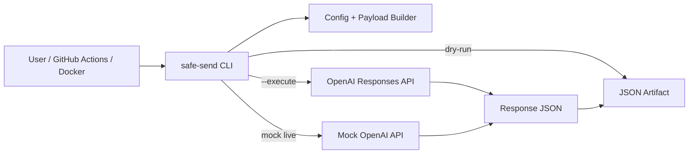

# ChatGPT Safe Message Sender

ChatGPT の Web UI をブラウザ操作で自動化するのではなく、OpenAI の公式 Responses API を使って、指定した文言を安全に送信する CLI です。

> 重要: このリポジトリは、ChatGPT Web UI に対して「人間のように見せる」「検知を回避する」「ブロックされないように偽装する」ためのブラウザ自動操作を実装しません。代わりに、公式 API を用いた明示的で監査しやすい自動化を提供します。

## できること

- 指定文言を OpenAI Responses API に送信する
- `--execute` を付けない限り API 送信しない安全な dry-run
- 送信 payload または API 応答を JSON として保存
- mock OpenAI API server を使った live 経路の integration test
- `make verify`、`tox`、`docker build` による GitHub Actions 非依存の検証
- workflow scope 復旧後に使える GitHub Actions テンプレート

## できないこと

- ChatGPT Web UI を Playwright / Selenium 等で操作すること
- CAPTCHA、レート制限、bot 検知、利用制限の回避
- 人間の操作に見せかけるマウス移動・タイピング偽装
- 大量送信、連続送信、スパム的な利用

## セットアップ

```bash
python -m venv .venv
source .venv/bin/activate
pip install -e .[dev]
```

API を実行する場合だけ、環境変数を設定します。

```bash
export OPENAI_API_KEY="sk-..."
```

## 使い方

### dry-run: 実送信せず payload を保存

```bash
safe-send --message "こんにちは。これはテストです。" --output outputs/payload.json
```

### 本番 API に単発送信

```bash
safe-send \
  --message "こんにちは。これは本番疎通テストです。" \
  --model gpt-4.1-mini \
  --execute \
  --output outputs/response.json
```

### ファイルから送信

```bash
safe-send --message-file sample_messages/hello.txt --execute --output outputs/response.json
```

## 検証

GitHub Actions が使えない状態でも、同等の検証を実行できるようにしています。

```bash
make verify
```

または:

```bash
bash scripts/run_local_ci.sh
bash scripts/run_until_green.sh
```

Docker build もテストゲートとして使えます。

```bash
docker build -t chatgpt-safe-message-sender:local .
```

## GitHub Actions / CI

GitHub Actions workflow 本体は、automation token の workflow 作成権限不足とみられる `404: Not Found` により `.github/workflows/*` へ直接作成できませんでした。復旧用テンプレートは以下に保存しています。

- `docs/workflows/ci.yml`
- `docs/workflows/live-smoke.yml`
- `docs/ci-recovery.md`

## Secrets

live smoke を使う場合のみ、Repository Secret に以下を設定します。

| Secret | 用途 |
| --- | --- |
| `OPENAI_API_KEY` | OpenAI Responses API を呼び出すための API key |

## アーキテクチャ



詳しくは [`docs/architecture.md`](docs/architecture.md) と [`docs/production-readiness.md`](docs/production-readiness.md) を参照してください。
