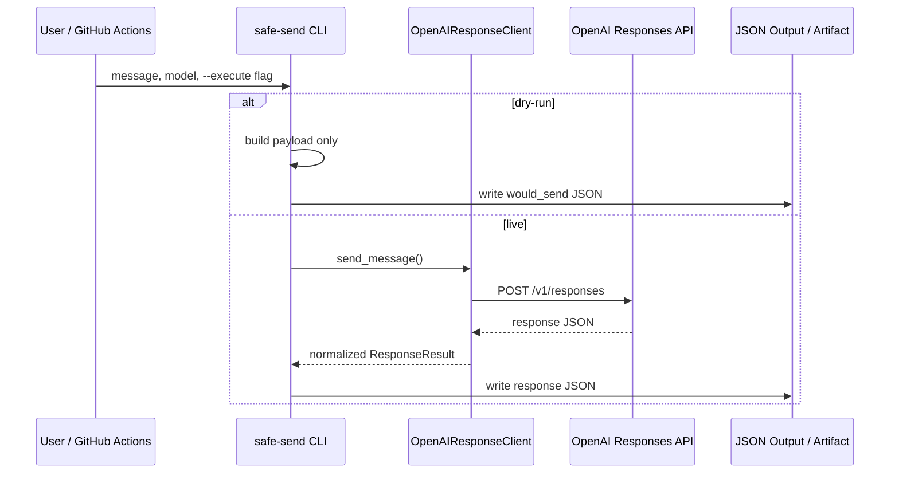
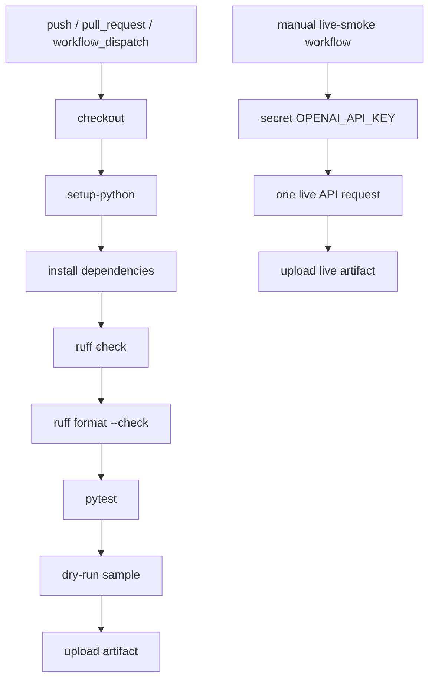

# Architecture

## 目的

このプロジェクトは、指定した文言を OpenAI Responses API に単発送信するための安全な CLI です。ChatGPT Web UI のブラウザ操作、人間らしい操作の偽装、検知回避、CAPTCHA 回避、レート制限回避は対象外です。

## コンポーネント

| コンポーネント | 役割 |
| --- | --- |
| `safe_message_sender.cli` | CLI 引数の解釈、dry-run / live 実行の切り替え、JSON 保存 |
| `safe_message_sender.client` | Responses API payload 作成、HTTP POST、応答正規化、エラー処理 |
| `scripts/live_smoke_test.py` | GitHub Actions からの単発 live smoke 実行 |
| `.github/workflows/ci.yml` | lint / format / test / dry-run artifact |
| `.github/workflows/live-smoke.yml` | 手動 workflow による本番 API 単発疎通確認 |

## 処理フロー

## セキュリティ設計

- API key は `OPENAI_API_KEY` 環境変数または GitHub Secret でのみ扱う
- リポジトリに secret 実値を保存しない
- `--execute` を付けない限り API を呼ばない
- 大量送信ループ、スケジューラー、リトライ連打を実装しない
- User-Agent は用途識別用であり、ユーザーエージェント偽装や検知回避を目的にしない

## CI/CD

## 今後の拡張案

- JSON schema による構造化出力
- 入力ファイルの複数テンプレート管理
- レスポンスのサマリ保存
- GitHub Actions environment approval を使った live smoke の承認ゲート
